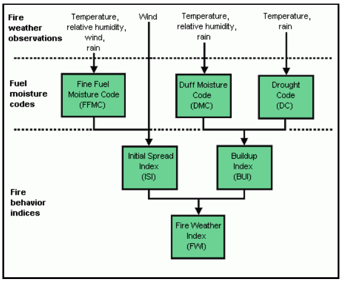
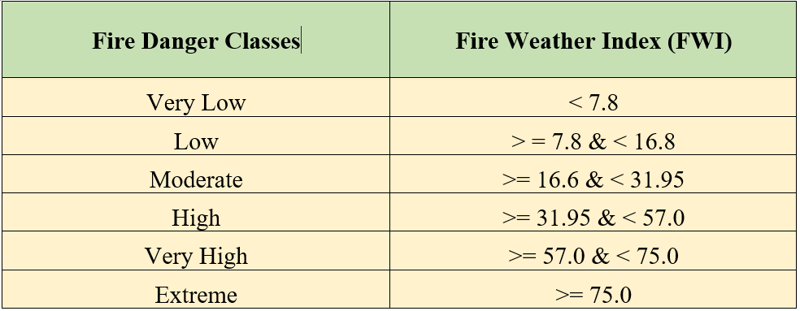

# Forest Fire Detection Using Neural Networks
by <b>Adharsh Venkatachalam</b>

Using  Multi-Layered Perceptron Neutral Networks (MLPNN) for the prediction of forest fire parameters

This project depicts the classic and highly effective algorithm, Multi-layer Perceptron Neural Network for regression. The idea is to predict the fire weather danger parameter, Fire Weather Index, in forest areas by taking into consideration the soil & weather factors to estimate the level of fire hazard in a forest area.

The FWI is a widely accepted index used to denote the level of fire risk, however, it is traditionally carried out by complex calculations of the weather indices including FMCC, DMC, DC, ISI, and BUI. Apart from the obvious disadvantage of not being able to assist in early forest fire detection, the procedure and methodology of its computation are not very lucid. By incorporating an MLPNN with a mesh of readily deployed Wireless Sensor Network (WSN), we will be in a position to predict any potential fire danger, faster and with much ease.

<b>Representation of the FWI System</b>

The main objective is to use deep learning to evaluate critical forest fire parameters, which will be discussed in detail in the coming sections, to predict the FWI and subsequently classify the output into one of the six classes of risk, namely Very Low, Low, Moderate, High, Very High and Extreme.

<b>Classifying the predicted output into Danger Classes</b>

